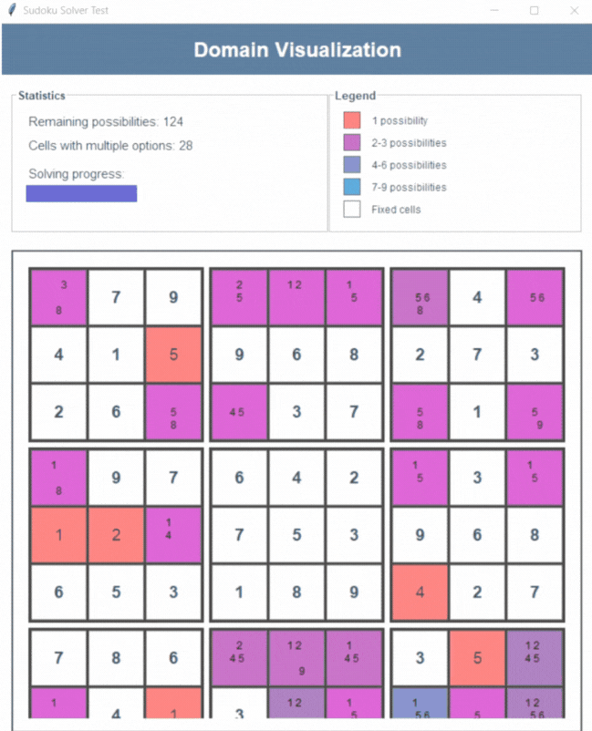
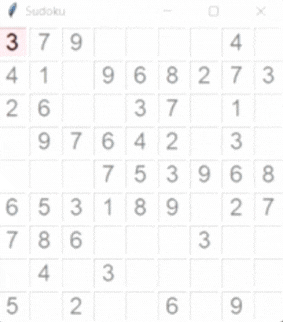

# Sudoku CSP Solver with Arc Consistency Visualization

A comprehensive Sudoku solver and interactive game implementing Constraint Satisfaction Problem (CSP) techniques with domain visualization.



## Table of Contents
- [Sudoku CSP Solver with Arc Consistency Visualization](#sudoku-csp-solver-with-arc-consistency-visualization)
  - [Table of Contents](#table-of-contents)
  - [Features](#features)
  - [Installation](#installation)
  - [Usage](#usage)
    - [Game Modes](#game-modes)
    - [Difficulty Levels](#difficulty-levels)
    - [Solving Options](#solving-options)
  - [Technical Implementation](#technical-implementation)
    - [CSP Approach](#csp-approach)
    - [Project Structure](#project-structure)
    - [Algorithms](#algorithms)
  - [Visualization](#visualization)
  - [Requirements](#requirements)
  - [Contributing](#contributing)

## Features

✔ **Dual Game Modes**  
- **AI Solver**: Watch the CSP algorithm solve puzzles step-by-step
- **Interactive Mode**: Solve puzzles manually with real-time validation

✔ **Smart Puzzle Generation**  
- Randomly generates solvable puzzles using backtracking
- Three difficulty levels (Easy, Medium, Hard)
- Custom puzzle input option

✔ **CSP Implementation**  
- Backtracking with forward checking
- Domain reduction through arc consistency
- Visual domain representation

✔ **Interactive Feedback**  
- Color-coded cell domains
- Real-time constraint validation
- Visual progress tracking



## Installation

1. **Prerequisites**: Python 3.8+ with Tkinter
2. Clone the repository:
   ```bash
   git clone https://github.com/alsafy01/sudoku-csp.git
   cd sudoku-csp
   ```
3. Run the application:
   ```bash
   python main.py
   ```

## Usage

### Game Modes
| Mode | Description |
|------|-------------|
| **Random** | Generates a new solvable puzzle |
| **Input** | Enter your own puzzle to solve |

### Difficulty Levels
| Level | Hidden Cells | Generation Time |
|-------|-------------|----------------|
| Easy | 30-40 | Fast |
| Medium | 45-55 | Moderate |
| Hard | 56-64 | Slow |

### Solving Options
1. **Solve (AI Mode)**:
   - Visualizes domain reduction
   - Shows backtracking steps
   - Displays solving time

2. **Let Me Try (Interactive Mode)**:
   - Manual number entry (1-9)
   - Real-time constraint checking
   - Error highlighting

## Technical Implementation

### CSP Approach
The implementation models Sudoku as a CSP with:
- **81 Variables** (9×9 grid cells)
- **Domains** (Possible values 1-9)
- **Constraints**:
  - Row uniqueness
  - Column uniqueness
  - 3×3 box uniqueness

### Project Structure
| File | Purpose |
|------|---------|
| `main.py` | Main GUI and mode selection |
| `sudoku_solver.py` | Backtracking algorithm |
| `sudoku_domain.py` | Domain visualization |
| `sudoku_board.py` | Interactive game board |
| `sudoku_generator.py` | Puzzle generation |
| `helper.py` | Utility functions |

### Algorithms
1. **Backtracking**:
   - Recursive depth-first search
   - Forward checking for early pruning

2. **Arc Consistency**:
   - Initial domain reduction
   - Constraint propagation
   - Domain visualization

## Visualization

The domain window provides real-time feedback:
- **Gray cells**: Fixed starting values
- **Colored cells**: Possible values
  - Color intensity indicates domain size
  - Darker = fewer options
  - Brighter = more options

Example domain progression:
1. Initial state: All possible values shown
2. After constraint propagation: Domains reduce
3. Solved state: Single value per cell

## Requirements

- Python 3.8+
- Tkinter (usually included with Python)
- No additional packages required

## Contributing

We welcome contributions! Please:
1. Fork the repository
2. Create a feature branch
3. Submit a pull request

Potential improvements:
- Implement AC-3 algorithm
- Add more visualization options
- Optimize solver performance